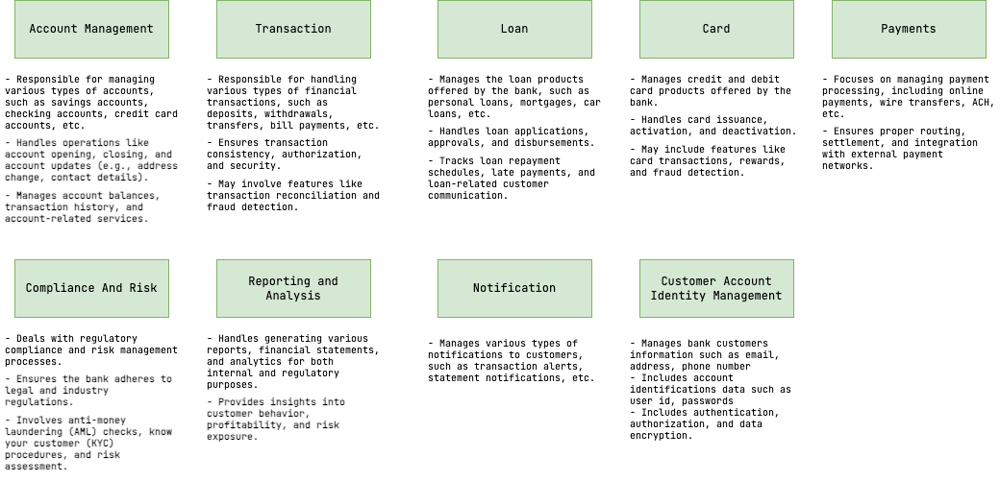

# BoR Architecture

## Bank Domain

Bank subdomains are stereotypical businesses representing internals of a typical bank. BoR models its domain
following this high level representation.

## Implementation Model

